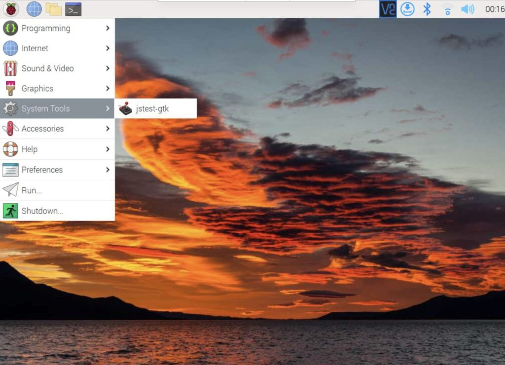
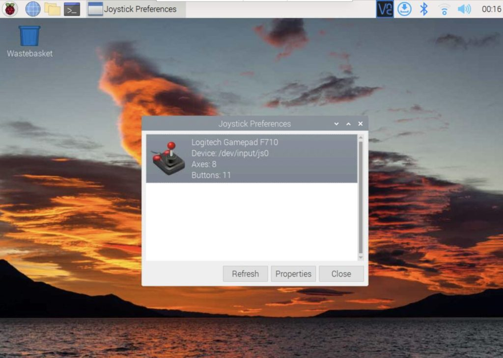
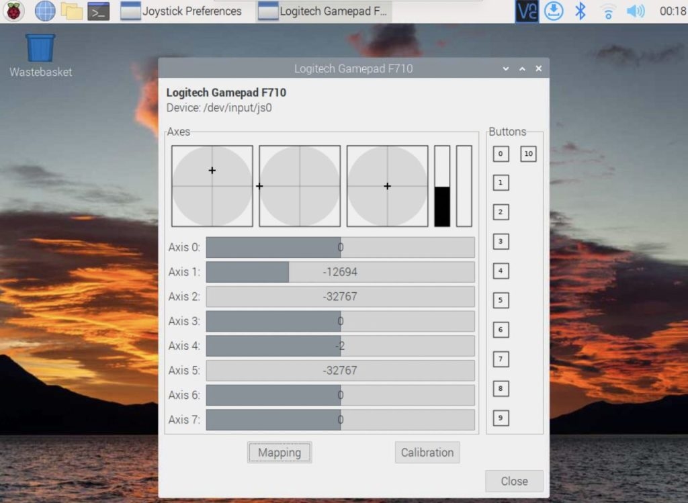

# ゲームパッドからTelloを操作

tag_name: FY2024, きのくにICT教育
最終更新日時: 2024年9月29日 14:46

# はじめに

ゲームパッドをRaspberry Piに接続し、ドローン（Tello）を操作するPythonのプログラムを作成する方法です。ドローン（Tello）をプログラムから操作するために、djitellopyライブラリを用いています。Raspberry Piに接続したゲームパッドの操作を認識できるようにするために、joystickパッケージをインストールします。Raspberry Piに接続したゲームパッドの操作を正しく読み取れているかを確認するためにjstest-gtkパッケージをインストールします。ゲームパッドの操作をPythonのプログラムから認識するためにpygameライブラリを用いています。最後に作成したプログラムを示します。

# 動作環境

- Raspberry Pi 4 Model B Rev 1.4 (Raspberry Pi OS (64-bit) - Debian GNU/Linux 12 (bookworm))
- Logicool F310 Gamepad
- Tello EDU
- Wi-Fiアダプター（無線LAN子機）BUFFALO WMR-433W2 Series
- Python 3.11.2
- djitellopy 2.5.0
- pygame 2.6.0
- joystick 1.8.1-1 arm64
- jstest-gtk 0.1.1~git20160825-4 arm64

# djitellopyライブラリのインストール

Telloドローンをプログラムで操作するために必要なdjitellopyライブラリをインストールする。

```bash
$ pip3 install djitellopy
```

# joystickパッケージのインストール

Raspberry Piからゲームパッドを使用するには、joystickパッケージをインストールする必要があります。
以下のコマンドでjoystickパッケージをインストールしてください。

```bash
$ sudo apt install joystick
```

# joystick動作確認パッケージ jstest-gtk

jstest-gtkをインストールするとGUIでjoystickの動作確認ができます。

### インストール

以下のコマンドでjstest-gtkパッケージをインストールできます。

```bash
$ sudo apt install jstest-gtk
```

### 動作確認

インストールした jstest-gtk はラズパイのSystem Toolsの中に入っています。クリックして開きます。



ゲームパッドをラズパイのUSBポートに挿し、認識されているか確認する。認識されない場合は、USBポートが挿さっているか確認したのち、”Refresh”ボタンを押してみてください。”Properties” ボタンをクリックすると、ゲームパッドの操作がリアルタイムで表示される画面に移ります。



ゲームパッドを操作し、どの操作がどのようにコンピュータに認識されているか確認できます。
ただし、スティック操作の数値の範囲はPython側で読み取ると別の範囲として認識されます（プラスマイナスは同じ）。



# pygameモジュールのインストール

ゲームパッドの入力を取得するには `pygame` を使用します。
pygameモジュールはゲームパッドの入力を取得するだけでなくPythonで簡単なゲームを作成することができるライブラリです。
以下のコマンドでpygameモジュールをインストールできます。

```bash
$ pip3 install pygame
```

# プログラムに使われている主要な関数の説明

## `pygame.joystick.Joystick()`

ゲームパッドのオブジェクトを作成する。オブジェクトとはデータ（属性やプロパティ）と、そのデータに関連する動作（メソッドや関数）を一つにまとめたものです。

### `pygame.joystick.Joystick()` オブジェクトの関数

`.get_axis(スティックナンバー)` ：スティックの値を取得
*操作レバーの現在の傾き位置を取得します。 `スティックナンバー` に取得したいスティックのナンバーを指定します。*
スティックの傾き位置を戻り値として返します。取得される値は-1から1の範囲となり、値が0の場合レバーは中央にあります。

`.get_button(ボタンナンバー)` ：ボタン類の値を取得
*現在のボタンの状態を取得します。 `ボタンナンバー` に取得したいボタンのナンバーを指定します。*
ジョイスティック機器に搭載されたボタンの現在の状態を `True か False` として返します。 `True` の場合はボタンが押されているという意味、 `False` の場合はボタンが押されていないという意味になります。

### 自作関数`map_axis(数値)` の説明

この関数 `map_axis(数値)` は、スティックの入力値をドローンが認識できる範囲の値に変換するためのものです。具体的には、スティックの入力値が -1.0 から 1.0 の範囲であるのに対し、ドローンは -100 から 100 の範囲の値を必要とします。この変換を行うのが `map_axis()` 関数です。 `数値` にゲームパッドから取得した値を指定します。
計算方法として、線形補間を用いている。線形補間とは、次のように2点 $(x0, y0)$ と $(x1, y1)$ を直線で結んだ時に、間にある任意の $x$ 座標に対応する $y$ を計算することです。


線形補間の基本式は次の式になります。

$$
y = y_0 + (y_1 - y_0) \frac{x - x_0}{x_1 - x_0}
$$

 $x_0$ `(in_min = -1)` から $x_1$ `(in_max = 1)` の範囲の値である $x$ を用いて、 $y_0$ `(out_min = -100)` から $y_1$ `(out_max = 100)` の範囲の値である $y$ を求めている。

### もっとわかりやすい説明

**入力値の範囲内での位置を計算**

```python
(val - in_min) / (in_max - in_min)
```

ここでは、入力値 `val` が入力範囲内のどこに位置するかを計算しています。

$$
\frac{0.5 - (-1)}{1 - (-1)} = \frac{1.5}{2} = 0.75
$$

これは、 `val`が入力範囲の75%の位置にあることを意味します。

**出力範囲にスケーリング**

```python
(out_max - out_min) * ((val - in_min) / (in_max - in_min))
```

次に、この位置を出力範囲にスケーリングします。

$$
(100 - (-100)) \times 0.75  = 200 \times 0.75 = 150
$$

**出力範囲の最小値を加算**

```python
out_min + (out_max - out_min) * ((val - in_min)  / (in_max - in_min))
```

最後に、出力範囲の最小値を加算して、最終的な出力値を得ます。

$$

(-100) + 150 = 50
$$

これにより、入力値 0.5 が出力値 50 に変換されます。

# プログラム

```python
#!/usr/bin/env python
# -*- coding: utf-8 -*-

import sys
import time
from djitellopy import Tello, TelloException
import pygame
from pygame.locals import JOYAXISMOTION, JOYBUTTONDOWN
from functools import cache


def main():
    host = '192.168.13.3'
    tello_from_gamepad = TelloFromGamepad(host)
    tello_from_gamepad.start()


class TelloFromGamepad():
    def __init__(self, host, joystick_num=0):
        # pygameの初期化
        pygame.init()

        # Joystickオブジェクトの作成
        self.joystick = pygame.joystick.Joystick(joystick_num)
        self.joystick.init()
        print(f'Gamepad Name: {self.joystick.get_name()}')

        # Telloの初期化
        # Wi-Fiアクセスポイントへ接続する設定（Wi-Fi子機になるモード）にしている場合は
        # hostを指定してIPアドレスは現物に合わせる
        Tello.RETRY_COUNT = 1          # retry_countは応答が来ないときのリトライ回数
        Tello.RESPONSE_TIMEOUT = 0.01  # 応答が来ないときのタイムアウト時間
        self.tello = Tello(host=host)


    def start(self):
        try:
            self.tello.connect()  # Telloへ接続
        except KeyboardInterrupt:
            print('\n[Finish] Press Ctrl+C to exit')
            sys.exit()
        except TelloException:
            print('[Finish] Connection timeout')
            sys.exit()
        time.sleep(1)

        while True:
            try:
                # イベントの取得
                for event in pygame.event.get():
                    # イベントがスティック操作の場合
                    if event.type == pygame.locals.JOYAXISMOTION:
                        self.send_tello('rc',
                                        self.map_axis(round(self.joystick.get_axis(3), 2)),
                                        self.map_axis(-round(self.joystick.get_axis(1), 2)),
                                        self.map_axis(-round(self.joystick.get_axis(4), 2)),
                                        self.map_axis(round(self.joystick.get_axis(0), 2))
                                        )
                    # イベントがボタン操作の場合
                    elif event.type == pygame.locals.JOYBUTTONDOWN:
                        if self.joystick.get_button(7):
                            self.send_tello('takeoff')
                        elif self.joystick.get_button(6):
                            self.send_tello('land')
                        elif self.joystick.get_button(3):
                            self.send_tello('flip_forward')
                        elif self.joystick.get_button(0):
                            self.send_tello('flip_back')
                        elif self.joystick.get_button(2):
                            self.send_tello('flip_left')
                        elif self.joystick.get_button(1):
                            self.send_tello('flip_right')
                        elif self.joystick.get_button(8):
                            print('[Finish] Press emergency button to exit')
                            self.send_tello('emergency')
            # Ctrl+Cが押された
            except KeyboardInterrupt:
                print('[Warnning] Press Ctrl+C to exit')
                self.send_tello('emergency')


    # スティックの出力数値を調整
    # -1.0 ~ 1.0 の数値を -100 ~ 100 の数値に変換
    # 線形補間を用いて計算している
    @cache
    def map_axis(self, val):
        # 小数点以下2桁に四捨五入

        # 入力の最小値と最大値
        in_min = -1
        in_max = 1
        # 出力の最小値と最大値
        out_min = -100
        out_max = 100
        # 線形補間を用いて計算
        return int(out_min + (out_max - out_min) * ((val - in_min) / (in_max - in_min)))


    # send_rc_control(left_right, forward_backward, up_down, yaw)
    # left_right                 left -100 ...  100 right
    # forward_backward           forw  100 ... -100 backw
    # up_down                      up  100 ... -100 down
    # yaw (rotate)      counter clock -100 ...  100 clock
    def send_tello(self, cmd, left_right=0, forward_backward=0, up_down=0, yaw=0):
        if cmd == 'land':
            self.tello.land()
        elif cmd == 'takeoff':
            self.tello.takeoff()
        elif cmd == 'flip_forward':
            self.tello.flip_forward()
        elif cmd == 'flip_back':
            self.tello.flip_back()
        elif cmd == 'flip_left':
            self.tello.flip_left()
        elif cmd == 'flip_right':
            self.tello.flip_right()
        elif cmd == 'rc':
            self.tello.send_rc_control(left_right, forward_backward, up_down, yaw)
        elif cmd == 'emergency':
            print('\nEmergency Stop!!\n')
            self.tello.emergency()
            print(f'[Battery] {self.tello.get_battery()}%')
            self.game_finish()


    def game_finish(self):
        print('[Finish] Game finish!')
        del self.tello
        sys.exit()


if __name__ == '__main__':
    main()
```
